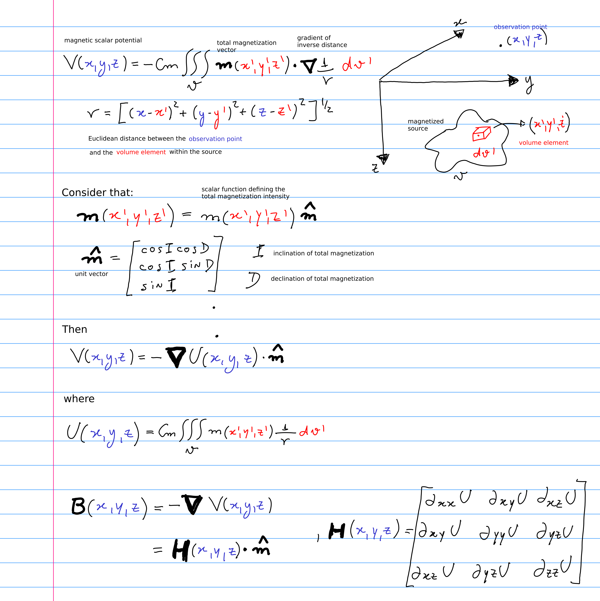

# Métodos Potenciais

Disciplina eletiva oferecida no [Programa de Pós-Graduação em
Geofísica](http://www.on.br/index.php/pt-br/programas-academicos/geofisica.html) do [Observatório Nacional](http://www.on.br).

**Responsável**: [Vanderlei C. Oliveira Jr.](http://www.pinga-lab.org/people/oliveira-jr.html)

**Aviso Legal:** O material disponibilizado neste repositório está em constante desenvolvimento e o Observatório Nacional não tem nenhuma responsabilidade sobre o seu conteúdo.

    

## Tópicos / Topics

* Sistemas de Coordenadas / Coordinate systems
* Campo de gravidade da Terra / Gravity field of the Earth
* Campo magnético da Terra / Magnetic field of the Earth
* Elementos de teoria do potencial / Elements of potential theory
* Gravimetria / Gravimetry
* Magnetometria / Magnetometry
* Modelagem direta / Forward modeling
* Separação regional residual / Regional-residual separation
* Técnicas para detecção de bordas / Edge-detection techniques
* Deconvolução de Euler / Euler Deconvolution
* Transformações de campos potenciais / Potential field transformations
* Inversão / Inversion

## Bibliografia / Bibliography

* Peirce, B. O. 1902. *Elements of the theory of the Newtonian potential function*.
Ginn & Company, Enlarged 3rd edition
* MacMillan, W. D. 1930. *The Theory of the Potential*. Dover Publications, Inc.
* Kellogg, O. D. 1967. *Foundations of Potential Theory*. Springer-Verlag.
* Blakely, R. J., 1996, *Potential theory in gravity and magnetic applications*. Cambridge
University Press.
* Hofmann-Wellenhof, B. e H. Moritz, 2005, *Physical Geodesy*. Springer.
* Sansò, F. e Sideris, M. G., 2013, *Geoid determination: Theory and Methods*.
Springer, Berlin, Heidelberg, ISBN 978-3-540-74699-7, DOI 10.1007/978-3-540-74700-0
* Langel, R. A. e W. J. Hinze, 1998, *The magnetic field of the Earth's lithosphere: the
satellite perspective*. Cambridge University Press.
* Artigos científicos / Scientific papers
